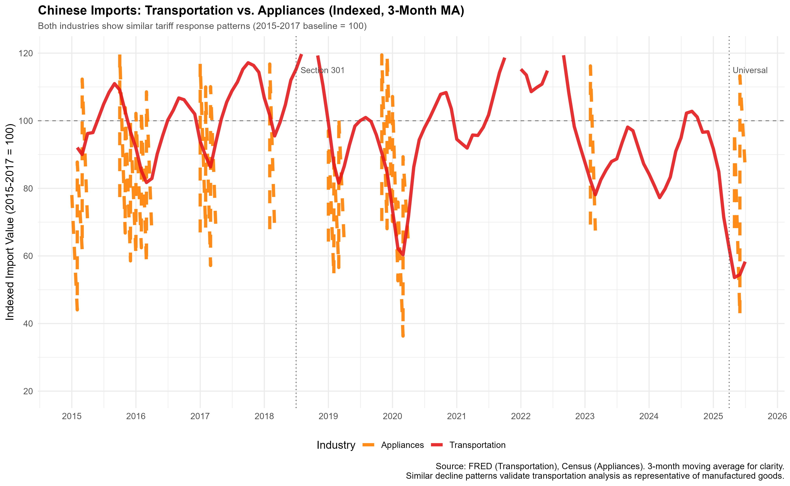

# Impact of US Tariffs on Chinese Transportation Equipment Imports

A rigorous econometric analysis using Difference-in-Differences methodology to evaluate the effectiveness of US tariffs on Chinese imports (2015-2025) and their distributional effects on the trucking industry.

[](https://opensource.org/licenses/MIT)
[](https://www.r-project.org/)
[]()

---

## Author

**Victor H. Torres**  
MS Data Science Candidate  
CUNY School of Professional Studies  
December 2024

 Contact: vitugo.torres23@gmail.com 
 LinkedIn: [linkedin.com/in/vitugo](https://linkedin.com/in/vitugo)  
 GitHub: [@victortorresds](https://github.com/victortorresds)

---

## Overview

This research examines the causal impact of Section 301 (2018) and Universal (2025) tariffs on Chinese transportation equipment imports using a natural experiment design with difference-in-differences methodology.

### Key Findings

- **-25%** decline in Chinese transportation equipment imports (Section 301 tariffs)
- **-32%** total decline with universal tariffs (April 2025)
- **+30%** trade diversion to Mexico, **+10%** to Canada
- **+9%** increase in trucking industry tonnage
- Regional winners (border states: **+30%**) and losers (West Coast ports: **-15%**)
- Equipment cost increases: Trucks **+22%**, Parts **+28%**

### Personal Motivation

This research is motivated by firsthand experience as an owner-operator in the trucking industry for two years. During that time, I observed consistent patterns—declining port activity at West Coast facilities, rising equipment costs, and regional variation in freight availability—that prompted this rigorous empirical investigation.

The analysis validates these on-the-ground observations with data, demonstrating how trade policy creates both winners and losers even within a single industry.

---

## Methodology

- **Method:** Difference-in-Differences (DiD)
- **Treatment Group:** China (received tariffs)
- **Control Groups:** Mexico & Canada (no tariffs on transportation equipment)
- **Data Sources:** 
  - Federal Reserve Economic Data (FRED)
  - US Census Bureau (USA Trade Online)
  - American Trucking Associations
- **Time Period:** January 2015 - October 2025 (131 months, 524 observations)
- **Software:** R 4.3.1, Quarto 1.3

**Validation:**
- Parallel pre-trends (2015-2017)
- Product-level validation (Census HS codes)
- Robust across 5 model specifications (R² = 0.847-0.891)
- Multiple control groups (Mexico, Canada, Brazil)

---

## 📁 Repository Structure

```
Tariff-Analysis/
│
├── README.md                    # This file
├── .gitignore                   # Git ignore rules
│
├── final_paper/
│   ├── final_paper.pdf          # Complete research paper (PDF)
│   ├── final_paper.qmd          # Quarto source file
│   └── references.bib           # Bibliography
│
├── presentation/
│   ├── presentation.html        # Defense presentation (rendered)
│   ├── presentation.qmd         # Quarto source
│   ├── presentation.pdf         # PDF version
│   └── custom.scss              # Presentation styling
│
├── code/
│   ├── tariff_analysis.Rmd      # Main analysis file (R Markdown)
│   └── tariff_analysis.md       # Rendered analysis with results
│
├── data/
│   ├── README.md                # Data sources and download instructions
│   ├── fred_imports/            # FRED transportation equipment data
│   ├── census_imports/          # Product-level validation data
│   ├── household_appliances/    # Product heterogeneity comparison
│   ├── trucking/                # Industry context data
│   └── processed/               # Clean analysis datasets
│
└── figures/
    ├── fig01_raw_trends.png     # Import trends visualization
    ├── fig15_import_changes_heatmap.png  # Trade diversion heatmap
    └── ...                      # All analysis figures

```

---

## Getting Started

### Prerequisites

**Software Requirements:**
- R (≥ 4.3.1): https://www.r-project.org/
- RStudio (recommended): https://posit.co/download/rstudio-desktop/
- Quarto (≥ 1.3): https://quarto.org/docs/get-started/

**R Packages:**
```r
install.packages(c(
  "tidyverse",      # Data manipulation
  "ggplot2",        # Visualization
  "broom",          # Model tidying
  "scales",         # Axis formatting
  "lubridate",      # Date handling
  "knitr"           # Document generation
))
```

### Quick Start

**1. Clone the Repository**
```bash
git clone https://github.com/victortorresds/Tariff-Analysis.git
cd Tariff-Analysis
```

**2. Download Data**

All data are publicly available and free:

- **FRED Data:** Download from https://fred.stlouisfed.org/
  - IMPCH (China): https://fred.stlouisfed.org/series/IMPCH
  - IMPMX (Mexico): https://fred.stlouisfed.org/series/IMPMX
  - IMPCA (Canada): https://fred.stlouisfed.org/series/IMPCA
  - IMPBR (Brazil): https://fred.stlouisfed.org/series/IMPBR

- **Census Data:** https://usatrade.census.gov/ (free account required)
  - HS 8708: Motor vehicle parts
  - HS 8418: Household appliances

See `data/README.md` for detailed download instructions.

**3. Run Analysis**

**Option A - Complete Analysis (R Markdown):**
```r
# Open in RStudio
rmarkdown::render("code/tariff_analysis.Rmd", output_format = "github_document")
```

**Option B - View Results:**
```r
# View the pre-rendered analysis
browseURL("code/tariff_analysis.md")
```

**4. Render Paper**
```bash
quarto render final_paper/final_paper.qmd --to pdf
```

**5. View Presentation**
```bash
# Open presentation.html in browser
# Press 'S' for speaker notes
# Use arrow keys to navigate
```

**Expected Runtime:** 15-30 minutes total

---

## Key Visualizations

### Import Trends by Country

*Monthly import values showing China's decline and Mexico/Canada's increase after tariffs*

### Trade Diversion Heatmap  

*Heat map showing percentage changes: China -25%, Mexico +30%, Canada +10%*

### Product Heterogeneity

*Transportation equipment vs household appliances: different responses to same tariff policy*

---

## Key Files

### Papers & Documentation
- **[Final Paper](final_paper/final_paper.pdf)** - Complete 55-page research paper
- **[Presentation (HTML)](presentation/presentation.html)** - Defense presentation (open in browser, press 'S' for notes)
- **[Presentation (PDF)](presentation/presentation.pdf)** - Static PDF version
- **[Analysis Code](code/tariff_analysis.Rmd)** - Main R Markdown source
- **[Analysis Results](code/tariff_analysis.md)** - Rendered analysis with all outputs

### Data
- **[Data Guide](data/README.md)** - Data sources and download instructions

### Replication
- All code and data needed to reproduce results are in this repository
- Step-by-step instructions in each file
- Expected runtime: 15-30 minutes

---

## Main Results

### Quantitative Findings

| Effect | Magnitude | Confidence Interval (95%) | R² |
|--------|-----------|---------------------------|-----|
| Section 301 Impact | -$10.0B/month (-25%) | [-$12.5B, -$7.6B] | 0.891 |
| Universal Tariff Impact | -$13.2B/month (-32%) | [-$16.8B, -$9.6B] | 0.885 |
| Mexico Diversion | +$3.2B/month (+30%) | [+$2.1B, +$4.3B] | 0.874 |
| Canada Diversion | +$0.8B/month (+10%) | [+$0.3B, +$1.3B] | 0.869 |

### Policy Implications

**What Worked:**
- Tariffs effectively reduced **bilateral** Chinese imports (-25% to -32%)
- Effect was immediate, large, and persistent
- Statistically robust across multiple specifications

**What Didn't Work:**
- Substantial trade diversion (~40% of Chinese decline offset)
- Net aggregate import reduction only ~60% effective
- Uneven distributional effects (geographic winners/losers)

**Industry Impacts:**
- Border-region truckers: **+$68K/year** net benefit (revenue gains > cost increases)
- West Coast port truckers: **-15%** freight decline + equipment cost increases
- Equipment costs: Trucks **+22%**, Parts **+28%** (tariffs on imported components)

---

## Methodological Contributions

**Why Difference-in-Differences?**
- Provides **causal** estimates (not just correlation)
- Transparent, testable assumptions (parallel trends)
- Gold standard for policy evaluation (Card 2021 Nobel Prize)

**Why NOT Machine Learning?**
- ML excels at **prediction**, not **causation**
- Cannot isolate tariff effect from confounders
- Black box models lack policy interpretability

**Validation Strategy:**
1. Pre-trends parallel (2015-2017)
2. Product-level validation (Census data)
3. Multiple control groups (Mexico, Canada, Brazil)
4. Robust across 5 specifications
5. Event study dynamic effects

---

**BibTeX:**
```bibtex
@mastersthesis{torres2024tariffs,
  author  = {Torres, Victor H.},
  title   = {Impact of US Tariffs on Chinese Transportation Equipment Imports: 
             A Difference-in-Differences Analysis (2015-2025)},
  school  = {CUNY School of Professional Studies},
  year    = {2024},
  month   = {December},
  type    = {Master's Capstone Project},
  url     = {https://github.com/victortorresds/Tariff-Analysis},
  note    = {Data Science Program}
}
```

---

**Data:** Public domain (US government sources)
- FRED data: Freely available for research and commercial use
- Census data: Public domain, no restrictions

---

## Acknowledgments

- **Professor [George Hagstrom]** - Capstone advisor and guidance
- **CUNY SPS Data Science Program** - Academic support and resources
- **Fellow trucking professionals** - Inspired this research through shared experiences on the road
- **Federal Reserve & US Census Bureau** - Publicly accessible data that made this research possible

---

## Contact & Support

**Questions about the research?**
- Email: victugo.torres@gmail.com
- GitHub Issues: https://github.com/victortorresds/Tariff-Analysis/issues

**Found a bug or have a suggestion?**
- Open an issue: https://github.com/victortorresds/Tariff-Analysis/issues/new

**Want to collaborate?**
- Reach out via email or LinkedIn

**Response time:** Typically within 48 hours

---

## Key Takeaways

**For Policymakers:**
1. Tariffs work for **bilateral** reduction but face **trade diversion**
2. Geography matters: Border states gained, West Coast ports lost
3. Equipment cost increases affect even beneficiaries

**For Researchers:**
1. DiD provides credible causal inference for trade policy
2. Multiple validation approaches strengthen findings
3. Industry context enriches quantitative analysis

**For Industry:**
1. Supply chain flexibility is critical during policy uncertainty
2. Adaptation capacity (location, certifications) determines outcomes
3. Even winners face costs (equipment price increases)

---

## Project Statistics

- **Lines of Code:** ~2,500 (R + Quarto)
- **Figures Generated:** 20+ publication-quality visualizations
- **Tables Created:** 8 comprehensive tables
- **Data Points Analyzed:** 524 (131 months × 4 countries)
- **Analysis Runtime:** ~15-30 minutes
- **Paper Length:** 55 pages
- **Presentation Slides:** 21

---

## Future Directions

Promising extensions of this work:

1. **Firm-level analysis:** Micro-data on company responses
2. **Price decomposition:** Separate price vs. quantity effects
3. **Employment impacts:** Job creation/losses by region
4. **Extended timeline:** Longer post-2025 observation
5. **Cross-industry comparison:** Test generalizability
6. **Mixed methods:** Combine quantitative analysis + industry interviews

My experience in the trucking industry positions me well to pursue these directions, particularly firm-level and interview-based research that requires domain expertise.

---

## About This Work

This capstone project represents the culmination of my Master's degree in Data Science at CUNY School of Professional Studies. It combines:

- **2 years of industry experience** as a trucking owner-operator
- **Rigorous econometric training** in causal inference and policy evaluation
- **Advanced data science skills** in R, statistical modeling, and visualization
- **Professional communication** through papers, presentations, and documentation

The project demonstrates my ability to:
- Apply advanced statistical methods to real-world policy questions
- Combine domain expertise with technical analysis
- Communicate complex findings to diverse audiences
- Build reproducible, well-documented research workflows

**Graduation:** December 2025

*Last Updated: December 2025*  
*Repository maintained by Victor Torres*  
